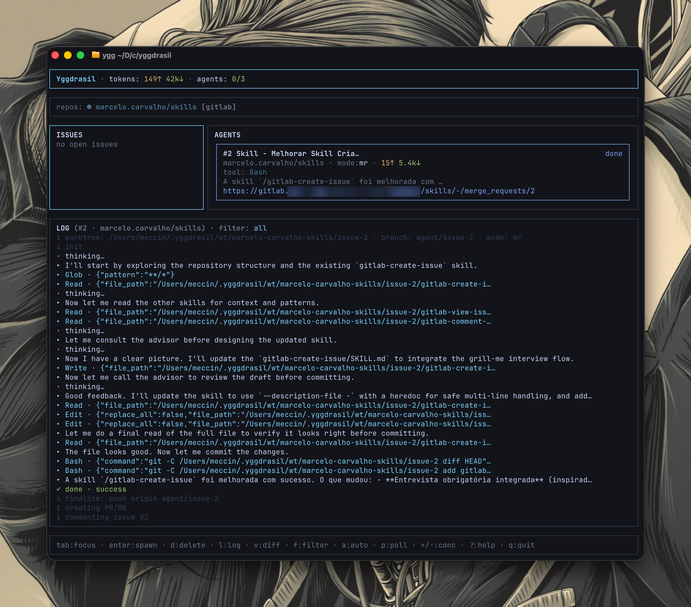
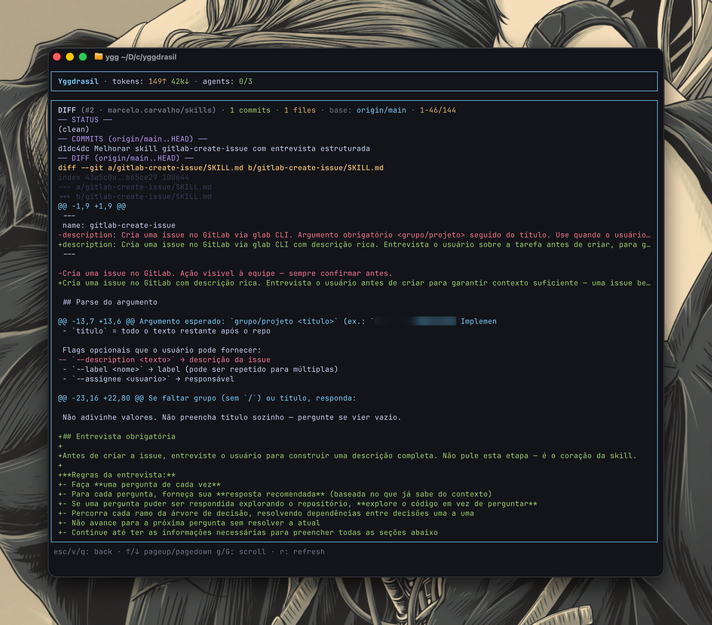
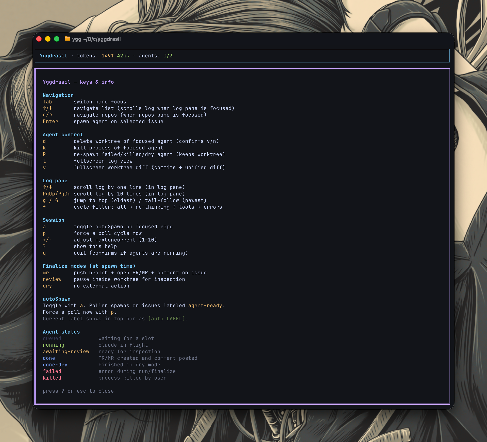

# Yggdrasil

TUI multi-agent dashboard for Claude Code on top of GitLab or GitHub issues.
Dispatch N agents in parallel, each working on its own issue inside an isolated
`git worktree`.

> *"From Yggdrasil's branches, ravens fly to every realm."*

## Screenshots

**Main view** — issues, agents, and the live log:



**Diff viewer** (`v`) — commits + unified diff vs `origin/<base>`:



**Help modal** (`?`) — keybindings and status reference:



## Requirements

- [Bun](https://bun.sh)
- [Claude Code CLI](https://claude.com/claude-code) (`claude`)
- One of:
  - [GitLab CLI](https://gitlab.com/gitlab-org/cli) (`glab`) — for GitLab repos
  - [GitHub CLI](https://cli.github.com/) (`gh`) — for GitHub repos
- `git`

## Install

```bash
cd /path/to/yggdrasil
bun install
bun link
ygg doctor
```

`bun link` exposes the `ygg` binary in `~/.bun/bin/` (make sure that's in your `$PATH`).

## Quick start

```bash
cd /path/to/your/git/repo
ygg            # prompts to run the setup wizard when no repos configured
# or
ygg init       # always launches the wizard
```

The wizard walks through five screens — environment checks, repo path,
provider confirm, permission preset (`safe` / `balanced` / `yolo`), and
label + finalize mode — then drops you straight into the TUI. Use it for
your first install or whenever you'd rather not memorise the flag matrix.

<video src="https://github.com/user-attachments/assets/c2c807fa-96c3-4e6a-95ec-2632f1a65d08" controls width="720">
  Your browser does not support the video tag —
  <a href="docs/screenshots/yggdrasil-wizard.mp4">download the demo</a>.
</video>

Everything the wizard sets is also reachable via `ygg repo add` /
`ygg repo set` / `ygg config set` for scripting and power use.

## CLI

```
ygg                                  # opens TUI (prompts wizard when no repos configured)
ygg init                             # interactive setup wizard
ygg repo add <path> [opts]           # register a repo (or update if name exists)
    --label NAME                     # custom autoSpawn label (default: agent-ready)
    --provider gitlab|github         # force provider (auto-detected by default)
    --claude-dir PATH                # custom CLAUDE_CONFIG_DIR for this repo
ygg repo set <name> [opts]           # edit fields on an existing repo
    --label NAME
    --claude-dir PATH|none           # `none` clears (back to ~/.claude default)
    --permission-mode MODE|none
    --default-mode mr|review|dry|none
    --allow-tool TOOL                # repeatable; replaces repo allowlist
    --disallow-tool TOOL             # repeatable; replaces repo denylist
    --settings PATH|none             # path to a Claude Code settings JSON
    --profile NAME|none|reset        # pipeline profile (see "Profiles" below)
    --reset-tools                    # clear repo allow/deny → inherit global
ygg repo list
ygg repo rm <name>
ygg config show                      # print global defaults
ygg config set [opts]                # edit global defaults
    --poll-interval N                # seconds (>= 60)
    --max-concurrent N               # 1..10
    --permission-mode MODE
    --default-mode mr|review|dry
    --notifications on|off
    --profile NAME|none              # default pipeline for every repo
ygg profile list                     # profiles in ~/.yggdrasil/profiles/
ygg profile show <name>              # print parsed contents
ygg profile init <name> [opts]       # scaffold a new profile
    --template harness|openspec|blank
ygg profile rm <name>                # delete a profile file
ygg profile path <name>              # print on-disk path (pair with $EDITOR)
ygg metrics [opts]                   # show usage metrics
    --repo NAME
    --since YYYY-MM-DD
    --until YYYY-MM-DD
    --json
ygg doctor                           # validate environment (claude, glab/gh auth, config)
ygg --version
ygg --help
```

### Self-hosted GitLab

For self-hosted GitLab instances, the stored `remoteRepo` slug includes the
host (e.g. `gitlab.example.com/team/project`) so `glab` resolves to the right
API endpoint. `ygg repo add` auto-detects this from `git remote get-url
origin`. Old entries without the host are migrated automatically on the next
`ygg` run (only when the detected slug strictly adds a host prefix — manual
edits are preserved).

## Configuration file

`~/.yggdrasil/config.json` is editable by hand. After any manual change,
restart `ygg`. Shape:

```jsonc
{
  "permissionMode": "acceptEdits",       // global default
  "maxConcurrent": 3,                    // 1..10
  "pollIntervalSec": 300,                // >= 60
  "defaultMode": "review",               // mr | review | dry
  "allowedTools": ["Read", "Write", "Edit", "Glob", "Grep", "Bash"],
  "disallowedTools": [],
  "settingsPath": null,                  // global claude --settings path
  "profile": null,                       // global pipeline profile (see "Profiles")
  "repos": [
    {
      "name": "owner/project",
      "path": "/abs/path/to/repo",
      "provider": "gitlab",              // gitlab | github
      "remoteRepo": "host/owner/project",
      "autoSpawn": false,
      "autoSpawnLabel": "agent-ready",
      "permissionMode": null,            // null = inherit global
      "defaultMode": null,               // null = inherit global
      "claudeConfigDir": null,           // null = ~/.claude
      "allowedTools": null,              // null = inherit global; array overrides
      "disallowedTools": null,
      "settingsPath": null,
      "profile": null                    // null = inherit global; string = override
    }
  ]
}
```

## On-disk layout

User data (created on first run):

```
~/.yggdrasil/
├── config.json             # repos, defaults
├── state.json              # agents persisted between runs
├── metrics.ndjson          # usage events (append-only, rotates at 5MB)
├── metrics.ndjson.1..5     # rotated archives, oldest dropped first
├── profiles/<name>.json    # pipeline profiles (optional; see "Profiles")
├── wt/<repo>/issue-<id>/   # worktrees
└── logs/<agent>.ndjson     # raw stream-json output, per agent (oldest pruned beyond 200)
```

## Finalize modes

- **mr**: push branch, open PR/MR (`glab mr create` or `gh pr create`), comment back on the issue. If the branch already exists upstream, push new commits and comment with the existing PR/MR.
- **review**: pause inside the worktree for you to inspect.
- **dry**: no external action.

Configurable per agent at spawn time (modal) and as a per-repo default (`defaultMode`).

### Issue comment

After `mr` finalizes, the issue gets a comment containing the agent's final
summary plus a link to the PR/MR. Yggdrasil instructs the agent to write that
summary **in the same language as the issue description**, so localized issues
get localized replies without configuration.

### Commit & PR/MR authorship

The agent prompt explicitly tells `claude` **not** to add `Co-Authored-By`
trailers or `Generated with Claude Code` taglines to commit messages or PR/MR
descriptions. PR/MR body uses `--fill` (derived from commits), so removing the
tagline at commit time also removes it from the PR/MR.

## Per-repo Claude account (`claudeConfigDir`)

Claude Code stores credentials/config under `~/.claude` by default. If you have
multiple Claude accounts (personal, work, team), Claude Code respects the
`CLAUDE_CONFIG_DIR` env var to point at a different directory (e.g.
`~/.claude2`, `~/.claude-work`).

Yggdrasil lets you bind a Claude config dir per repo. Set it at add time:

```bash
ygg repo add /path/to/repo --claude-dir ~/.claude-work
```

Or change it on an existing repo:

```bash
ygg repo set <name> --claude-dir ~/.claude-work
ygg repo set <name> --claude-dir none     # back to the default ~/.claude
```

`ygg repo list` shows the current value. When an agent spawns, the runner
exports `CLAUDE_CONFIG_DIR=<the value>` only for that `claude -p` process —
your interactive shell is untouched.

## Permission mode

Global default: `acceptEdits`. Per-repo override allowed. Accepted values (passed
to `claude -p --permission-mode`): `acceptEdits | auto | bypassPermissions |
default | dontAsk | plan`.

Worktree isolation keeps the blast radius of `bypassPermissions` contained to a
single branch.

## Tool permissions

`permission-mode` controls **how approval gates behave** for headless spawns,
but it does not gate **which tools** an agent may invoke. v0.6 introduces an
allowlist + denylist that pipe straight into `claude --allowed-tools` and
`claude --disallowed-tools`. Both compose with the permission mode — even
under `bypassPermissions`, anything outside the allowlist is refused, and
anything in the denylist is refused unconditionally.

### Defaults

Out of the box the global allowlist is:

```
Read, Write, Edit, Glob, Grep, Bash
```

Covers the standard coding-agent flow (read context, edit code, run
`git`/`bun`/`npm` via Bash). `WebFetch`, `Task` (subagent delegation),
`NotebookEdit`, and others are **not** allowed by default — opt in per repo if
your workflow needs them.

### Per-repo overrides

```bash
# Tighten: only allow reads + edits, no Bash.
ygg repo set owner/proj \
  --allow-tool Read \
  --allow-tool Edit \
  --allow-tool Write

# Add a denylist on top of the inherited allowlist:
ygg repo set owner/proj \
  --disallow-tool 'Bash(rm *)' \
  --disallow-tool 'Bash(git push --force *)'

# Clear all per-repo tool overrides → inherit global:
ygg repo set owner/proj --reset-tools
```

`--allow-tool` and `--disallow-tool` are repeatable. Each invocation
**replaces** the previous per-repo list (it is not additive). Reads of `ygg
repo list` show `(global)` next to fields that fall back to inheritance.

### Pattern syntax

Tool names alone admit every invocation. Patterns can scope further:

| Example                              | Meaning                                |
|--------------------------------------|----------------------------------------|
| `Bash(git *)`                        | only `git` shell commands              |
| `Bash(bun run *)`                    | only `bun run` invocations             |
| `Edit(/src/**)`                      | only edits under `src/`                |
| `WebFetch(domain:gitlab.example.com)`| only fetches from that domain          |

Pattern matching follows the
[Claude Code permissions](https://code.claude.com/docs/en/permissions.md)
syntax.

### `--settings` for richer policy

For policies that don't fit a flat allow/deny list (workspace-scoped paths,
domain rules, hook integration), point a repo at a Claude Code settings JSON:

```bash
ygg repo set owner/proj --settings ~/.claude/yggdrasil-strict.json
```

The file is forwarded verbatim via `claude --settings <path>` and accepts the
same shape as `~/.claude/settings.json` (notably the `permissions` block with
`allow`, `deny`, and `ask` keys). `ygg doctor` validates that the file exists
and parses as JSON. Clear it back to inheriting the global default with
`--settings none`.

`ygg doctor` also emits a warning (non-fatal) when a repo runs the most
permissive combination: `permissionMode: bypassPermissions` with an
empty effective allowlist. Worktree is the only blast-radius boundary in
that case — the warning is there to make sure that's intentional.

### Recommended hardening for headless

```bash
ygg repo set owner/proj \
  --permission-mode dontAsk \
  --allow-tool Read \
  --allow-tool Write \
  --allow-tool Edit \
  --allow-tool Glob \
  --allow-tool Grep \
  --allow-tool 'Bash(git *)' \
  --allow-tool 'Bash(bun *)' \
  --disallow-tool 'Bash(rm -rf *)' \
  --disallow-tool 'Bash(git push --force *)'
```

`dontAsk` auto-denies everything outside the allowlist without prompting (vs.
`bypassPermissions`, which strips gates entirely). The combination keeps
spawns fully headless while bounding the blast radius beyond just the
worktree.

## Global config

Everything in `~/.yggdrasil/config.json` outside the `repos` array is global
defaults (`permissionMode`, `defaultMode`, `maxConcurrent`, `pollIntervalSec`,
plus the v0.6 `allowedTools`/`disallowedTools`/`settingsPath`). Edit those
without opening the file:

```bash
ygg config show
ygg config set --poll-interval 60 --max-concurrent 5
```

`ygg config set` validates each flag (poll interval `>= 60`, concurrency
`1..10`, etc.) before writing. Per-repo overrides keep flowing through
`ygg repo set` / `ygg repo list`.

### Desktop notifications

Default `on`. When an agent reaches a terminal status (`done`, `done-dry`,
`awaiting-review`, `failed`, `killed`), Yggdrasil fires a desktop
notification with the issue id, title, and outcome — so you can context-
switch away from the TUI without losing track of long runs.

```bash
ygg config set --notifications off    # disable
ygg config set --notifications on     # re-enable
```

Backend: `osascript` on macOS, `notify-send` on Linux, silent no-op on
Windows or when the helper binary isn't installed. Failures inside the
notifier are swallowed — they never crash the parent TUI.

## Profiles (pipelines)

By default each agent runs **one** `claude -p` invocation per issue. For workflows that
split planning, implementing, and evaluating into discrete phases
([Sleipnir](https://github.com/meccin/sleipnir)/harness, OpenSpec, etc.), Yggdrasil can
drive a **linear pipeline** of slash-commands instead — configured via a *profile*.

A profile is a JSON file in `~/.yggdrasil/profiles/<name>.json` describing the ordered
steps. Each step is one `claude -p "<command> <args>"` call inside the same worktree as
its neighbors, so artifacts produced by step N (plan files, generated tests, etc.) are
available to step N+1. If any step exits non-zero the agent is marked `failed` and the
remaining steps are skipped. The standard `push + MR/PR + comment` finalize runs once
after the last step succeeds.

**Profiles are opt-in.** When neither the global config nor a repo references one,
agents keep running the classic single-prompt flow byte-for-byte.

### Scaffolding

```bash
ygg profile init my-flow --template harness     # /harness-plan → /harness-implement → /harness-evaluate
ygg profile init my-flow --template openspec    # /opsx:propose → /opsx:apply → /opsx:verify
ygg profile init my-flow --template blank       # one empty step
```

The scaffold writes `~/.yggdrasil/profiles/my-flow.json`. Edit it directly:

```bash
$EDITOR $(ygg profile path my-flow)
```

### Wiring it up

```bash
ygg config set --profile my-flow            # default for every repo
ygg repo set owner/proj --profile other     # per-repo override
ygg repo set owner/proj --profile none      # explicit "no pipeline" (overrides global)
ygg repo set owner/proj --profile reset     # inherit global again
```

`ygg profile list` annotates each profile with the configs that reference it. `ygg
doctor` validates that every referenced profile exists and parses.

### Schema

```jsonc
{
  "name": "harness",
  "steps": [
    {
      "name": "plan",                              // display only
      "command": "/harness-plan",                  // slash-command (must exist in your claude install)
      "args": "Issue #{{issue.id}}: {{issue.title}}\n\n{{issue.body}}",
      "permissionMode": "plan"                     // optional per-step override
    },
    {
      "name": "implement",
      "command": "/harness-implement",
      "args": "Implement plan for issue #{{issue.id}}.",
      "permissionMode": "acceptEdits"
    },
    {
      "name": "evaluate",
      "command": "/harness-evaluate",
      "args": "Run sensors and review. Do not push — supervisor handles that."
    }
  ]
}
```

Each step also accepts optional `allowedTools` / `disallowedTools` (arrays). Cascade
for permission mode and tools: `step.X ?? repo.X ?? global.X`.

#### Template variables (in `args`)

| Variable               | Value                                       |
|------------------------|---------------------------------------------|
| `{{issue.id}}`         | issue iid                                   |
| `{{issue.title}}`      | issue title                                 |
| `{{issue.body}}`       | issue description (truncated at 50KB)       |
| `{{branch}}`           | agent's working branch                      |
| `{{worktree}}`         | agent's worktree absolute path              |
| `{{repo.name}}`        | local repo name                             |
| `{{repo.remoteRepo}}`  | GitLab/GitHub slug                          |
| `{{step.name}}`        | current step's `name`                       |

Unknown keys collapse to empty string. Whitespace inside `{{ ... }}` is tolerated.
Literal `{{` cannot be escaped in v1.0.0 — write that elsewhere if you need it raw.

### Loops & retries

Yggdrasil **does not loop steps in v1.0.0**. If your final step needs to retry on
sensor failure, that retry must happen *inside* that slash-command —
[Sleipnir](https://github.com/meccin/sleipnir)'s full-auto mode already does this.
Yggdrasil-driven retry loops are tracked for post-v1.0.0.

### TUI

While a profile is active, the agent card shows `[N/M]` next to its status. A
`system` log line like `step 2/3: implement` marks each boundary so the timeline in
the log pane is auditable.

### Re-spawn (`R`)

Re-spawning a failed agent with a profile **restarts from step 1**, reusing the
worktree (so any commits made by earlier steps are preserved on the branch). Step
state is not resumed mid-pipeline.

### Gotchas

- **Don't `git push` from inside a step.** Yggdrasil owns the push + MR/PR + comment
  step. The shipped scaffolds tell the last step "do not push — the supervisor handles
  that"; keep that line (or its equivalent) when you edit. Uncommitted leftovers are
  handled automatically (see below); pushing manually breaks the flow.
- **Leftover artifacts are auto-committed before push.** External slash-commands often
  write files (specs, evaluation reports, etc.) without committing them. In `mr` mode,
  if the last step exits cleanly but the worktree is still dirty, Yggdrasil runs
  `git add -A && git commit -m "chore: agent artifacts for #N"` before pushing — so
  the MR always lands. The auto-commit runs only after a successful final step; it
  never tries to ship a partial pipeline.
- **Slash-command must exist in your `claude` install.** Profiles dispatch via
  `claude -p "<command> ..."`; a typo or a missing plugin yields `claude exit ≠ 0` and
  the agent fails on that step. `ygg doctor` cannot verify slash-commands are
  installed — only that the profile file parses.
- **Token counters carry across steps.** Each `claude -p` is a fresh session whose
  token usage starts at zero; Yggdrasil sums them so the agent card and metrics show
  the cumulative total.
- **Missing profile is fatal at spawn.** If `config.json` references a profile name but
  the file vanishes, the agent fails loud (no silent fallback to single-shot). Fix it
  with `ygg doctor` + `ygg config set --profile none` (or restore the file).

## Re-spawning failed agents

When `claude -p` exits non-zero (network blip, transient gate, etc.) the
agent moves to `failed`. Press `R` on the focused agent to re-spawn it
in-place:

- Same `agent.id`, so the card and log history stay.
- Worktree + branch are reused when still valid on disk (commits the agent
  already made are preserved); rebuilt against `origin/<base>` if the path
  has been removed externally.
- Issue title/description are refetched from GitLab/GitHub so edits on the
  remote side reach the new run.
- A `system: respawn` line is appended to the log so the history of attempts
  is auditable. A fresh `agent_start` metric is recorded too.

`R` is rejected for `running`/`queued` agents (already active) and for
`done`/`awaiting-review` (intentional terminal states). Killed (`k`) and
`done-dry` agents are eligible.

## Auto-spawn

Toggle per repo with the `a` key in the TUI. While on, a poller (default every
5 minutes, configurable via `pollIntervalSec`) looks for open issues with the
configured label (`agent-ready` by default) and spawns agents up to
`maxConcurrent`.

Press `p` in the TUI to force a poll cycle immediately (handy after labeling
an issue without waiting for the interval). The countdown in the header resets.

### Changing the autoSpawn label

The label is per repo. The active value shows up in the top bar as
`[auto:LABEL]` whenever autoSpawn is on. Change it via:

```bash
ygg repo set <name> --label my-custom-label
```

Or set it at add time with `ygg repo add --label NAME`. Editing
`~/.yggdrasil/config.json` directly also works (restart `ygg` afterward).

## Metrics

Each agent emits `agent_start`, `tool_use`, and `agent_end` events to
`~/.yggdrasil/metrics.ndjson`. Aggregate them with:

```bash
ygg metrics
ygg metrics --since 2026-05-01 --repo owner/project
ygg metrics --json | jq '.byRepo'
```

Output includes: total agents by status, tokens in/out, average duration,
breakdown by day, by repo, top issues by token spend, and a tool histogram.

### Rotation

To keep the user directory bounded:

- `metrics.ndjson` rotates when it grows past 5MB. Up to 5 archives are kept
  (`metrics.ndjson.1` … `metrics.ndjson.5`); `ygg metrics` reads across all of
  them so older history stays queryable.
- `~/.yggdrasil/logs/` is capped at 200 files. Each TUI startup prunes the
  oldest agent logs beyond that.

Both limits are conservative defaults — no configuration knob yet.

### Hydration recovery

On every TUI start, persisted agents are reconciled before render:

- Agents persisted as `running` or `queued` (the parent process is gone)
  become `failed` with a clear `errorMessage`.
- Agents in `awaiting-review` whose worktree was deleted off-disk between runs
  also become `failed`, so you never see a stale review pointer.

## Keybindings (TUI)

| Key       | Action |
|-----------|--------|
| `Tab`     | switch pane focus |
| `↑/↓`     | navigate list — scrolls the log when the log pane is focused |
| `←/→`     | navigate repos (when repos pane is focused) |
| `Enter`   | spawn agent on selected issue |
| `d`       | delete worktree of focused agent (confirms `y/n`) |
| `k`       | kill process of focused agent |
| `R`       | re-spawn focused failed/killed/dry agent (keeps worktree+branch) |
| `l`       | fullscreen log view |
| `v`       | fullscreen worktree diff (commits + unified diff vs `origin/<base>`) |
| `PgUp`/`PgDn` | scroll log ±10 lines (in log pane) |
| `g` / `G` | jump to top (oldest) / tail-follow (newest) in the log pane |
| `f`       | cycle log filter: `all → no-thinking → tools → errors` |
| `a`       | toggle autoSpawn on focused repo |
| `p`       | force a poll cycle now |
| `+`/`-`   | adjust `maxConcurrent` (1–10) |
| `?`       | show keys & info help page |
| `q`       | quit (confirms if agents running) |
| `Ctrl+C`  | panic close (skips confirm, kills agents, restores screen) |

At spawn time the `SpawnModal` accepts `m` (mr), `r` (review), `d` (dry),
`Enter` (default), or `Esc` (cancel).

In the diff view (`v`): `↑/↓`, `PgUp/PgDn`, `g`/`G` scroll the same way as
the log pane. `r` re-runs the git commands (handy when the agent commits
while you're looking). `esc`/`v`/`q` returns to the main view.

### Log filters

- `all` — every event except token counters
- `no-thinking` — hides `thinking…` and token counters
- `tools` — only `tool_use` and final `done` events
- `errors` — only failed `done` events and `system` lines mentioning
  `error`/`fail`/`stderr`/`denied`

Consecutive `thinking…` events collapse into a single line `thinking… ×N`.

## Agent status

- `queued` (gray) — waiting for a slot
- `running` (green) — `claude` in flight
- `awaiting-review` (yellow) — review mode, ready for inspection
- `done` (blue) — PR/MR created and comment posted
- `done-dry` (blue) — finished in dry mode
- `failed` / `killed` (red)

## Tests

```bash
bun test
```

Covers pure functions: config resolution, tool-brief formatter, summary
extraction, remote-URL parsing, metrics aggregation, retry heuristic,
file/directory rotation, and profile template interpolation + validation.

## Known limitations

- `stream-json` schema may evolve; the parser ignores unknown events. Raw event
  output is preserved per agent under `~/.yggdrasil/logs/`.
- Retries are read-only (issue list/view, MR lookup). Write calls (comment,
  MR create) are still single-shot to avoid duplicating server-side effects.
